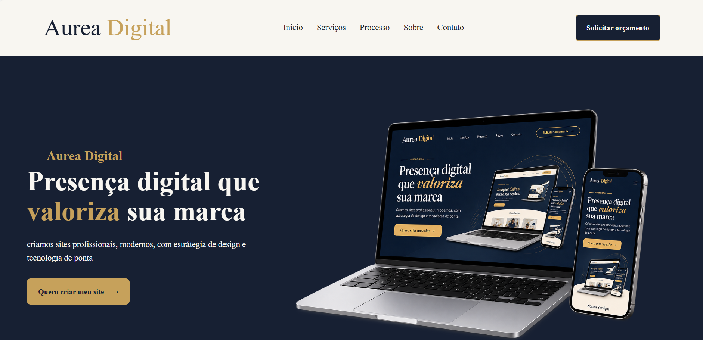
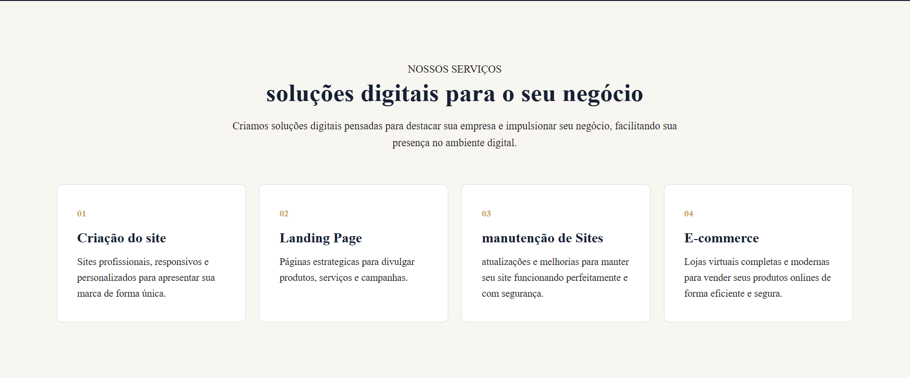
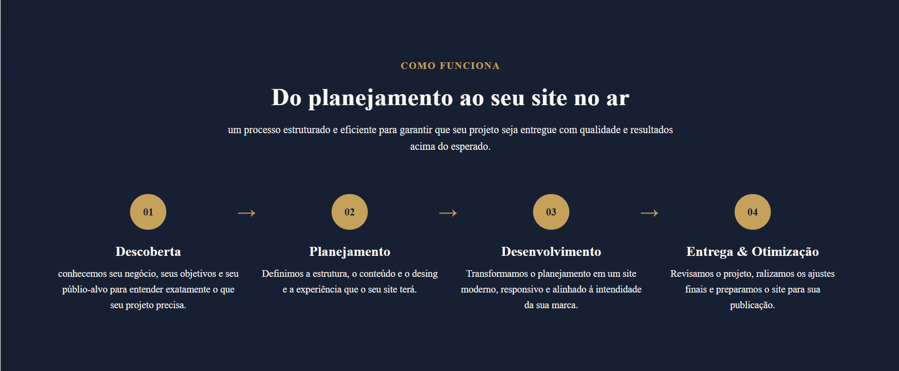
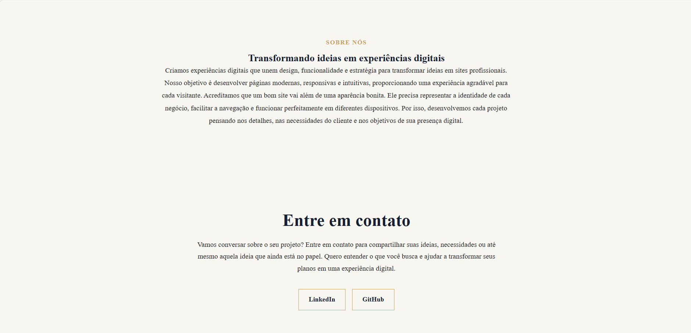
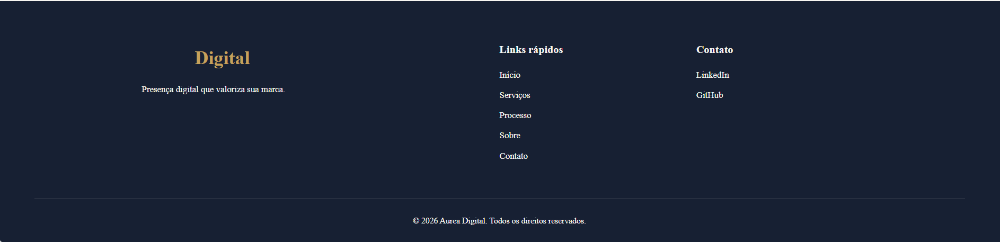

# ✨ Aurea Digital

> **Presença digital que valoriza sua marca.**

A **Aurea Digital** é um projeto de site institucional desenvolvido para apresentar uma agência digital, seus serviços, processo de desenvolvimento e canais de contato.

O projeto possui uma identidade visual moderna e elegante, utilizando uma combinação de **azul-marinho, dourado, branco quente e grafite**, além de uma estrutura responsiva para diferentes tamanhos de tela.

---

## 🖥️ Prévia do projeto

### 🏠 Início



A página inicial apresenta a proposta da Aurea Digital, destacando a criação de sites profissionais e a importância de uma presença digital de qualidade.

---

### 💼 Serviços



Nesta seção são apresentados os principais serviços oferecidos:

- Criação de Sites
- Landing Pages
- Manutenção de Sites
- E-commerce

---

### 🔄 Processo



A seção apresenta as etapas utilizadas no desenvolvimento de um projeto:

1. Descoberta
2. Planejamento
3. Desenvolvimento
4. Entrega & Otimização

---

### 📩 Contato



Área destinada ao contato com a Aurea Digital, disponibilizando acesso aos perfis profissionais no LinkedIn e GitHub.

---

### 🔻 Footer



O rodapé contém a identidade da Aurea Digital, links rápidos para navegação e informações de contato.

---

## 📌 Sobre o projeto

O projeto foi desenvolvido como uma página institucional para a **Aurea Digital**, com o objetivo de apresentar a empresa, seus serviços e sua proposta de trabalho.

A página possui uma navegação simples e organizada através de links internos, permitindo que o visitante acesse rapidamente cada seção.

### Seções do site

- **Início** — apresentação da Aurea Digital.
- **Serviços** — apresentação dos serviços oferecidos.
- **Processo** — explicação das etapas de desenvolvimento.
- **Sobre** — apresentação da proposta e visão da agência.
- **Contato** — canais de contato e redes profissionais.
- **Footer** — links rápidos e informações adicionais.

---

## 🚀 Funcionalidades

- Navegação entre as seções da página.
- Botão de solicitação de orçamento.
- Modal de solicitação de orçamento.
- Links para LinkedIn e GitHub.
- Cards para apresentação dos serviços.
- Etapas do processo de desenvolvimento.
- Efeitos de hover nos elementos interativos.
- Layout responsivo.
- Adaptação para desktop, tablet e celular.
- Favicon personalizado.

---

## 🛠️ Tecnologias utilizadas

### HTML5

Utilizado para estruturar o conteúdo da página:

- Header
- Navegação
- Seções
- Cards
- Processo
- Contato
- Footer

### CSS3

Utilizado para a criação da identidade visual, layout e responsividade.

Principais recursos utilizados:

- CSS Variables
- Flexbox
- CSS Grid
- Media Queries
- Transições
- Pseudo-elementos
- Responsividade

### JavaScript

Utilizado para controlar o modal de orçamento.

O JavaScript permite:

- Abrir o modal ao clicar em **"Solicitar orçamento"**.
- Fechar o modal através do botão `×`.
- Impedir o comportamento padrão do link de orçamento.

### Google Fonts

O projeto utiliza fontes do Google Fonts:

- Google Sans
- Oswald

---

## 🎨 Identidade visual

A identidade visual foi desenvolvida utilizando uma paleta de cores sofisticada e profissional.

| Cor | Código | Utilização |
|---|---|---|
| 🤍 Branco quente | `#F8F6F1` | Fundo principal |
| 🔵 Azul-marinho | `#172033` | Fundo escuro e títulos |
| 🟡 Dourado | `#C6A15B` | Destaques e botões |
| ⚫ Grafite | `#252525` | Textos |

As cores foram definidas utilizando **CSS Variables**, facilitando futuras alterações na identidade visual.

---

## 📱 Responsividade

O site foi desenvolvido para funcionar em diferentes dispositivos.

### 💻 Desktop

Na versão desktop:

- Menu horizontal.
- Seção inicial dividida entre texto e imagem.
- Serviços organizados em quatro colunas.
- Processo organizado em quatro etapas.

### 📱 Tablet

Em telas menores:

- Serviços passam para duas colunas.
- Processo passa para duas colunas.
- Espaçamentos e fontes são adaptados.

### 📱 Celular

Em dispositivos móveis:

- Conteúdo inicial passa para uma coluna.
- Cards ficam empilhados.
- Processo fica em uma única coluna.
- Navegação é reorganizada.
- Footer passa para uma estrutura vertical.
- Tamanhos de fontes são reduzidos.

---

## 📂 Estrutura do projeto

```text
projeto_agencia_Aurea_Digital/
│
├── index.html
├── style.css
├── script.js
├── README.md
│
└── assets/
    ├── contato.png
    ├── favicon.png
    ├── footer.png
    ├── inicio.png
    ├── preview-site.png
    ├── processo.png
    └── servicos.png
